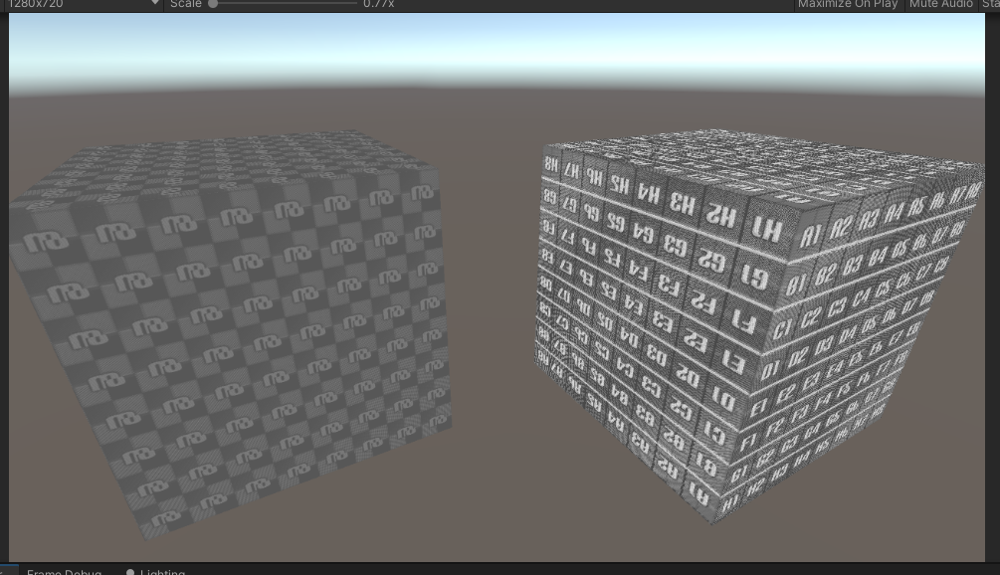

# unity-computeshader-gatherops
Unity project randomly checking Gather operations when used in compute shaders

Cube on the right uses a material whose fragment shader contains Gather commands.
Cube on the left uses texture written by a compute shader containing Gather commands.

